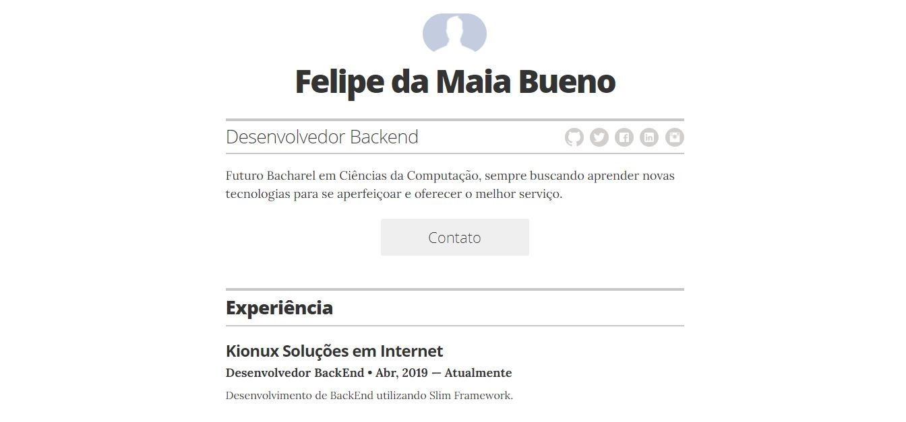

# Resume template

*A simple Jekyll + GitHub Pages powered resume template.*

## Docs

### Running locally

To test locally, run the following in your terminal:

1. Clone repo locally
1. `bundle install`
2. `bundle exec jekyll serve`
3. Open your browser to `localhost:4000`
